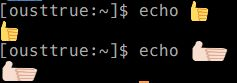

+++
date = 2019-04-18T01:00:00+09:00
tags = ['vim']
+++
# vim on Windows

常用エディタをvimに復古するべく環境を整備し始めた。
せっかくなので `neovim` も試してみる。

* 環境はWindows10

## neovim
* neovim本家サイトからダウンロード
    * https://github.com/neovim/neovim/releases
    * nvim-win32.zip
* python3の環境を作る
    * python36-32を入れた(nvimのバージョンに合わせた)
    * 環境変数PATHに `C:/Python36-32` と `C:/Python36-32/Scripts` を追加
    * `pip install neovim`

### nvim-qt.exe (gui)

だいたい動く。

* コピペはクリップボード経由で。`set clipboard+=unnamed`
* color emojiは諦める

### nvim.exe (cmd.exe)

だいたい動く。

* コピペはクリップボード経由で。`set clipboard+=unnamed`
* `set termguicolors` でフルカラー

### Oni(Electron製)

意外と良かったが細かいところ(日本語の変換中の表示とか)が使いづらかった。
`oni2` 作っているらしい。

* emoji とか見た目はいい

### $HOME/local/bin/nvim (wsl)

`mintty` が良くて、なかなか快適。

* Windowsのプロセスを実行する系は諦める(`!start .` とか)
* git とかさくさく動く
* もろもろ、パッケージマネージャーで入れるだけなので楽
* 無ければ、ソースからビルドするのも楽

既にWSLがインストール済みであるところから。
わいは、

* https://github.com/yuk7/ArchWSL

入れてる。

#### wslする端末を整備する

minttyのwsl向けのwslttyを使う。

* https://github.com/mintty/wsltty
* Cicaフォント
* xterm-256

color emoji を設定する。

* https://github.com/mintty/wsltty/issues/93
* `%USERPROFILE%\AppData\Roaming\wsltty` フォルダに対して作業する



複合文字とか複雑すぎなのでは・・・

#### nvimを自前ビルドする

足りないパッケージを適宜追加でインストールしながら。

```sh
mkdir -p $HOME/local/src
cd $HOME/local/src
git clone https://github.com/neovim/neovim.git
cd neovim
CMAKE_INSTALL_PREFIX=$HOME/local make install # $HOME/local/bin にインストールする
```

環境変数 `PATH` に `$HOME/local/bin` を足した

#### python3

```sh
pip install --user neovim
```

## vim8
### gvim

* `emoji` など難しいマルチバイト文字の入る文書を編集するときは最善でした

## cmd.exe

* [clink](https://mridgers.github.io/clink/)を導入して、cmd.exeの苦しさを軽減する(c-p, c-n, tab)
* `Cica` フォントなどを導入することで見た目はいい感じになる
* color emojiは諦める(cmd.exeの制約)
* 一応、 `chcp 65001` してから `vim` で `set encoding=utf8`
* color thema
    * https://github.com/Microsoft/console/tree/master/tools/ColorTool

ptyが入ったらしい。近々いい感じになりそう。
* https://devblogs.microsoft.com/commandline/windows-command-line-introducing-the-windows-pseudo-console-conpty/

* F1-F5は何故か、 `A, B, C, D, E` のキーコードで来る。

## powershell

普通に、readlineの設定があるのを発見した。

* 一度だけ、管理者権限でps1の実行許可を設定する必要あり
* `%USERPROFILE%\Documents\WindowsPowerShell\Microsoft.PowerShell_profile.ps1` を自分で作る

powershellの設定ファイルに下記のように設定すると、 `emacs` 風コマンドラインになって使いやすくなる。

```ps1
Set-PSReadlineKeyHandler -Key 'Ctrl+u' -Function BackwardDeleteLine
Set-PSReadlineKeyHandler -Key 'Ctrl+b' -Function BackwardChar
Set-PSReadlineKeyHandler -Key 'Ctrl+f' -Function ForwardChar
Set-PSReadlineKeyHandler -Key 'Ctrl+d' -Function DeleteChar
Set-PSReadlineKeyHandler -Key 'Ctrl+h' -Function BackwardDeleteChar
Set-PSReadlineKeyHandler -Key 'Ctrl+p' -Function HistorySearchBackward
Set-PSReadlineKeyHandler -Key 'Ctrl+n' -Function HistorySearchForward
Set-PSReadlineKeyHandler -Key 'Ctrl+a' -Function BeginningOfLine
Set-PSReadlineKeyHandler -Key 'Ctrl+e' -Function EndOfLine
Set-PSReadlineKeyHandler -Key 'Ctrl+m' -Function AcceptLine
Set-PSReadlineKeyHandler -Key 'Ctrl+k' -Function ForwardDeleteLine
```

