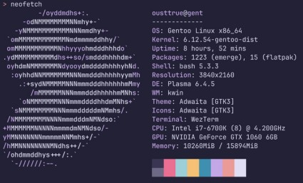
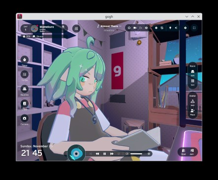

やっぱ Gentoo がしっくりくるのぅ。
Ubuntu は固より、Arch でも物足りない感じがするからのう。

手始めに `surface3 i5` に入れてみた。

改めてデスクトップ機に導入。

```
VGA compatible controller: NVIDIA Corporation GP106 [GeForce GTX 1060 6GB] (rev a1)
```



# systemd

ついに `systemd` にすることにした。
これはこれでよさもある。
gentoo だと crond, logd, dhcpcd などを systemd に内包されるもので楽ができる。

# bootloader を systemd-boot

設定の方法が分かれば、 `grub` など他の方法に比べてもシンプルでよい。

# portage の git 化

# guru 追加

# kernel ビルドはパス

binary dist を使わせてもらいました。

手順の分岐を混ぜるとシステムが壊れる。
kernel-bin なのに world すると、kernel-build が走る状態になって直せなかったのでやりなおした。

# llvm ビルド長い

`labwc` をビルドしたらやたら時間がかかったのだけど、
`mesa` => `galium` => `llvm` の依存になってしまったようだ。
うちのマシンでは3, 4時間要るのでは。
kernelビルドを回避した今、最大ビルドか。

# display server

`ly` を採用。
`zig` 製だったので自前ビルドしてみた。

`animation` を有効にすると `cpu` を `15%` 使いっぱなしになっていた w。
(ReleaseBuild になっていなかったかもしれない)
普通に時計だけの表示にして地味に。

framebuffer(yaftとか) のセッションを実験してみよう。

あと、普段使いに tmux のセッションとか作るといいかもしれない。
メンテナンス用に bash に降りる方法を確保した上で、
普段は login と同時に tmux 。

# go 系のツール

ghq, fzf, lazygit はマニュアルインストールにした。

# rust 系のツール

rg, fd, bottom, zoxide は emerge (guru) を使った。

## plasma

steam machine も plasma らしいし。

## pipewire

flagpak の backend で要るぽいし。

audio の権限回りが設定バリエーションが多くて難しい。
当初、ssh で remote login した session から音を鳴らそうとして難航した。
普通は desktop session により AudioDevice の権限を得るのだが、
Desktop 無しで mpd 等を鳴らすことを目論だ。
alsa の dmix を backend にすることで目的を達成できた。
alsa, piewire, systemd の user session の設定の組合せで設定できる。
できるが一般的でない設定は、同じことをやっている人が少ない。

```title="/etc/asound.conf"
ctl.!default {
  type hw
  card PCH
}

pcm.!default {
  type plug
  slave.pcm "dmix:PCH,0"
}

pcm.amp {
  type plug
  slave.pcm "dmix:AMPLIFIER,0"
}
```

```title="~/.config/pipewire/pipewire.conf"
    { factory = adapter
       args = {
           factory.name           = api.alsa.pcm.sink
           node.name              = "alsa-sink"
           node.description       = "PCM Sink"
           media.class            = "Audio/Sink"
           api.alsa.path          = "dmix:AMPLIFIER,0"
           # api.alsa.path          = "hw:0"
           # api.alsa.period-size   = 1024
           # api.alsa.headroom      = 0
           # api.alsa.disable-mmap  = false
           # api.alsa.disable-batch = false
           # audio.format           = "S16LE"
           # audio.rate             = 48000
           # audio.channels         = 2
           # audio.position         = "FL,FR"
       }
    }
```

## fcitx5 skk

gentoo に package が無かった。野良ビルド。`/usr/local` にインストールされた `so` に起因する問題ではまる。
`ld.so.conf` でできると思うのだが、面倒になって `/usr` にシンボリックリンクして動かしちゃった。
plasma の設定に中途半端に出てくるのが難しい。so not found で落ちていることが別らなかった。

`<C-Space>` 例

```json title="~/.config/libskk/rules/user/keymap/latin.json"
{
  "include": ["default"],
  "define": {
    "keymap": {
      "C-'": "set-input-mode-hiragana",
      "C- ": "set-input-mode-hiragana"
    }
  }
}
```

## WiVRn

OpenXR

## steam

そういや proton とか動くのかしら、とやってみたら動いた。
gentoo でも問題なかった。



systemd への乗り換えが功を奏している感がある。
もはや platform が systemd という情勢である。
`wayland` と `systemd --user` を基盤とする都合で仕方が無い。
